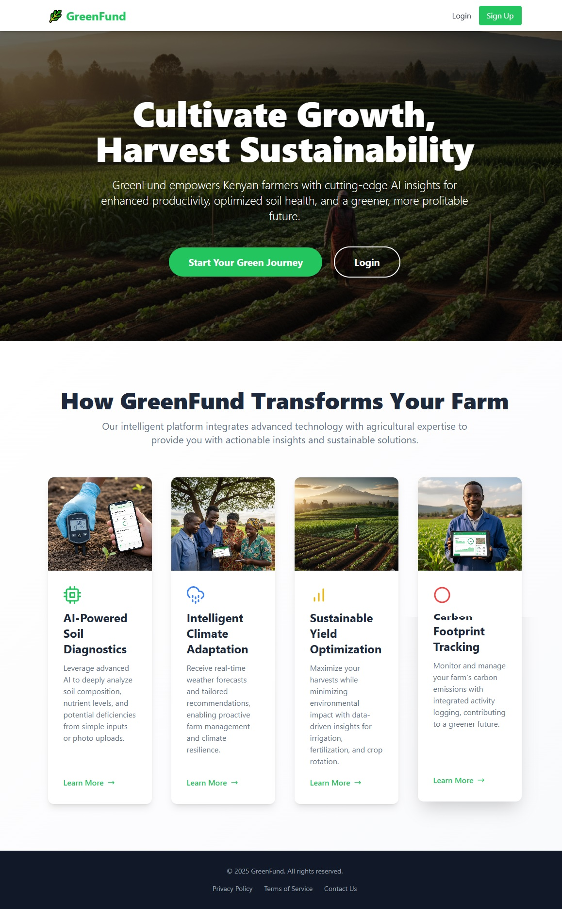
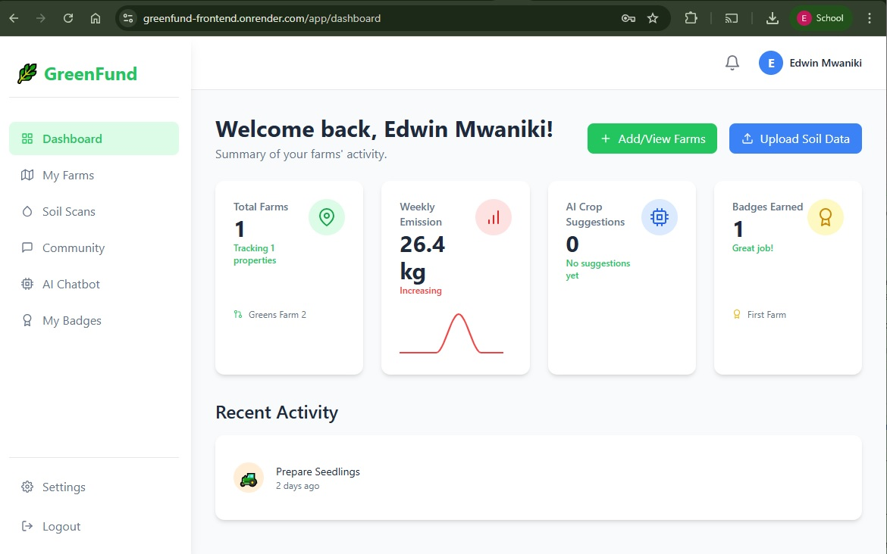
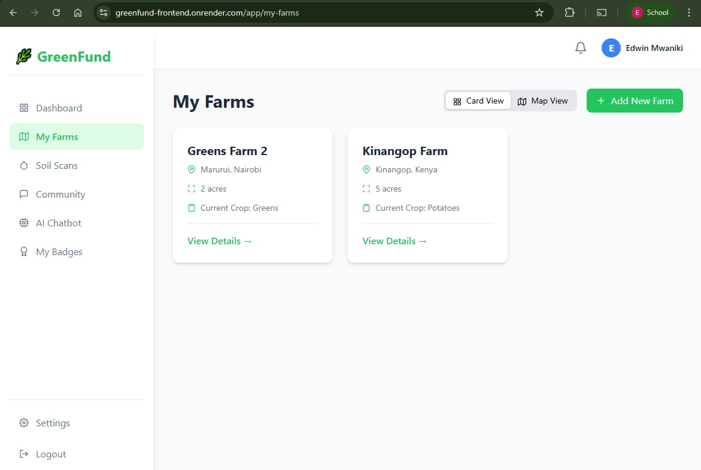
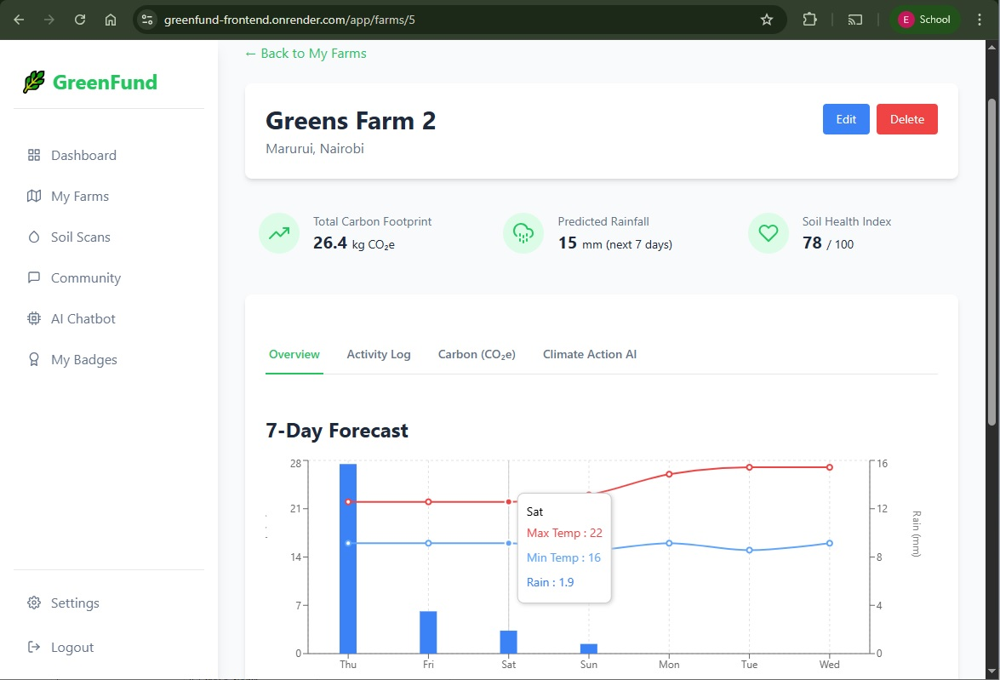
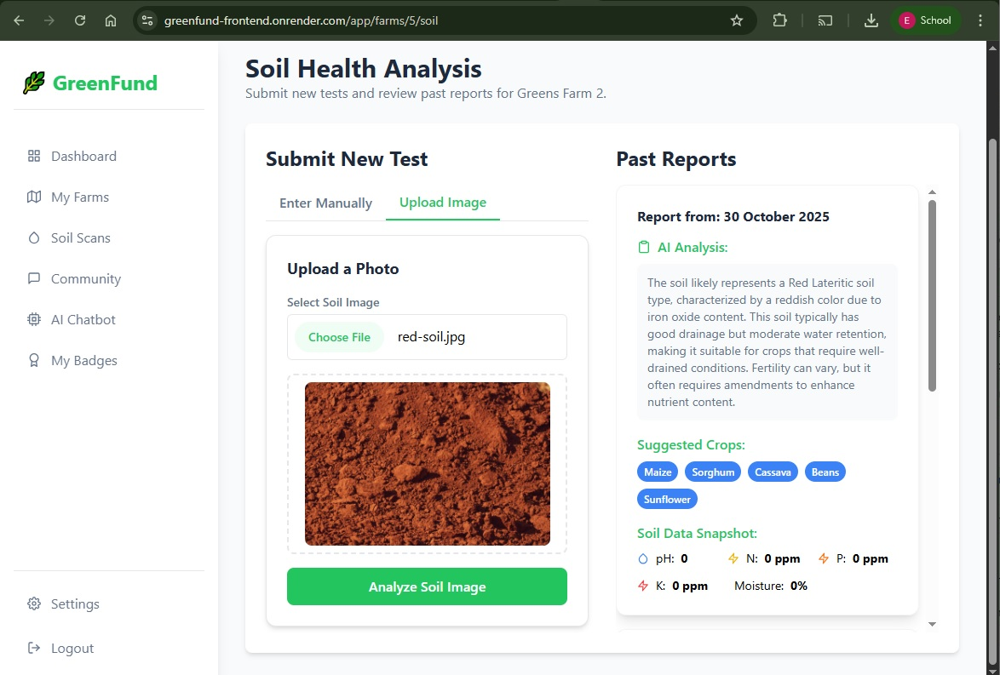

# GreenFund Backend API

## Authors
[Joan Rotich](https://github.com/joan-pookie), [Joe Wanjema](https://github.com/Jwanjema) and [Edwin Mwaniki](https://github.com/edwin3v3/)


A FastAPI-based backend system for the GreenFund platform, designed to help farmers track and manage their environmental impact, get climate-smart agriculture recommendations, and participate in a community-driven knowledge sharing platform.

## 🌱 Features

- **User Management**

  - Authentication with JWT tokens
  - User registration and profile management
  - Password hashing with bcrypt
  - Email validation

- **Farm Management**

  - Create and manage farm profiles
  - Track farm activities
  - Record location and size information
  - Monitor current crops

- **Environmental Monitoring**

  - Climate impact tracking
  - Soil health monitoring
  - Carbon footprint calculation
  - Environmental activity logging

- **Community Features**

  - Forum discussions
  - Achievement badges
  - Notifications system
  - Knowledge sharing

- **Climate Smart Agriculture**
  - Climate action recommendations
  - Pest and disease alerts
  - Water management advice
  - Crop suggestions based on soil conditions

## 🛠 Tech Stack

- **Framework**: FastAPI
- **Database**: PostgreSQL with SQLModel ORM
- **Authentication**: JWT tokens with bcrypt password hashing
- **Container**: Docker and Docker Compose
- **Migration**: Alembic
- **Testing**: pytest
- **API Documentation**: Swagger UI (built-in with FastAPI)

## 🤖 AI & ML Features

This project integrates AI to provide agronomic assistance and enrich soil/farm insights. The AI components combine simple rule-based logic (in `app/climate_rules.py`) with OpenAI-powered prompts (via `app/soil_model.py` and `app/recommendations.py`) to produce actionable guidance.

Key AI-powered capabilities:

- Chatbot: a farmer-facing assistant available at POST `/api/chatbot/ask` (router prefix `/chatbot`). The chatbot uses a system prompt tuned for Kenyan smallholder farmers and returns a short reply.
- Soil analysis (text): POST `/api/soil/manual` — submit soil measurements and the system will call the AI to return `ai_analysis_text` and `suggested_crops` which are stored with the `SoilReport`.
- Soil analysis (image): POST `/api/soil/upload_soil_image/{farm_id}` — upload a soil image; the backend sends the image to the AI multi-modal endpoint and stores the parsed analysis as a `SoilReport`.
- Crop suggestions summary: GET `/api/soil/suggestions/summary` — aggregates the latest AI suggestions across the user's farms.
- Climate actions: endpoints under `/api/climate-actions` use both rule-based assessments and AI refinement to provide:
  - Pest/disease alerts: GET `/api/climate-actions/alerts/{farm_id}`
  - Carbon guidance: GET `/api/climate-actions/carbon-guidance/{farm_id}`
  - Water management advice: GET `/api/climate-actions/water-management/{farm_id}`

Configuration & environment variables:

- `OPENAI_API_KEY` — required to use OpenAI services. Add it to your `.env` when running with real AI calls.

Example `.env` snippet:

```env
OPENAI_API_KEY=sk-xxxx-your-key-xxxx
DATABASE_URL=postgresql://postgres:postgres@db:5432/app_db
SECRET_KEY=your_secret_key_here
```

Cost, latency and safety notes:

- AI calls incur costs and add latency to endpoints — consider async patterns, caching, or background tasks for heavier jobs (e.g., large image analysis).
- Limit model usage and add rate-limiting / quotas to protect against abuse and runaway costs (not implemented by default).
- Ensure user consent for sending images/data to third-party AI services and consider redacting sensitive information.

Testing & local development (mocking AI):

- For tests, avoid calling the real OpenAI API. Mock `app.soil_model.get_openai_client` or patch the OpenAI client methods to return canned responses. Example strategies:
  - Use pytest monkeypatch to replace `get_openai_client` with a fake client that implements `.chat.completions.create`.
  - Use VCR-like fixtures to replay recorded responses if you have stable outputs.

Security and data retention:

- Store only the AI outputs that are necessary (the app stores `ai_analysis_text` and `suggested_crops`). Log minimal information about API responses.
- Rotate `OPENAI_API_KEY` regularly and do not commit it to source control. Use environment-backed secrets (Docker secrets, vault, etc.) in production.

## Key Screenshots of GreenFund App
### Landing Page
<p align="center">
  
</p>

| **Farmer's Dashboard**  | **Farms** (Card & Map View of Farmer's farms) |
|--------------------------|--------------------|
|  |  |

| **Farm Details** | **Farm - Soil Analysis** |
|--------------------------|--------------------|
|  |  |


## 🚀 Getting Started

### Prerequisites

- Docker and Docker Compose
- Python 3.8+
- PostgreSQL (if running locally)

### Environment Setup

1. Clone the repository:

   ```bash
   git clone https://github.com/Jwanjema/GreenFund-test-Backend.git
   cd GreenFund-test-Backend
   ```

2. Create a .env file:

   ```env
   DATABASE_URL=postgresql://postgres:postgres@db:5432/app_db
   SECRET_KEY=your_secret_key_here
   ALGORITHM=HS256
   ACCESS_TOKEN_EXPIRE_MINUTES=60
   ```

3. Start the services using Docker Compose:
   ```bash
   docker-compose up --build
   ```

### Local Development Setup

1. Create a virtual environment:

   ```bash
   python -m venv venv
   source venv/bin/activate  # On Windows use: venv\Scripts\activate
   ```

2. Install dependencies:

   ```bash
   pip install -r requirements.txt
   ```

3. Run migrations:

   ```bash
   alembic upgrade head
   ```

4. Start the development server:
   ```bash
   uvicorn app.main:app --reload
   ```

## 📚 API Documentation

- **Interactive Docs (Swagger UI):**  
  👉 [https://greenfund-backend.onrender.com/docs](https://greenfund-backend.onrender.com/docs)

- **Readable Docs (ReDoc):**  
  👉 [https://greenfund-backend.onrender.com/redoc](https://greenfund-backend.onrender.com/redoc)

Use the Swagger version to test endpoints directly.  
Use ReDoc for a clean reference overview.

### Main API Endpoints

- **Authentication**

  - POST `/api/auth/register` - Register new user
  - POST `/api/auth/token` - Login and get access token

- **Users**

  - GET `/api/users/me` - Get current user profile
  - PUT `/api/users/me` - Update user profile
  - POST `/api/users/me/change-password` - Change password

- **Farms**

  - GET `/api/farms` - List user's farms
  - POST `/api/farms` - Create new farm
  - GET `/api/farms/{farm_id}` - Get farm details
  - PUT `/api/farms/{farm_id}` - Update farm details

- **Environmental Monitoring**

  - POST `/api/activities` - Log farm activity
  - GET `/api/climate/actions` - Get climate action recommendations
  - POST `/api/soil/reports` - Submit soil analysis
  - GET `/api/soil/reports/{farm_id}` - Get soil reports

- **Community**
  - GET `/api/forum/threads` - List forum threads
  - POST `/api/forum/threads` - Create new thread
  - GET `/api/badges` - List available badges
  - GET `/api/notifications` - Get user notifications

## 🧪 Testing

Run the test suite:

```bash
DATABASE_URL=sqlite:/// pytest tests/ -v
```

## 📝 Database Migrations

Create a new migration:

```bash
alembic revision --autogenerate -m "description of changes"
```

Apply migrations:

```bash
alembic upgrade head
```

## 🔒 Security Features

- Secure password hashing using bcrypt
- JWT token authentication
- CORS middleware configuration
- Input validation using Pydantic models
- SQL injection prevention through SQLModel
- Rate limiting on sensitive endpoints

## 🤝 Contributing

1. Fork the repository
2. Create your feature branch
3. Commit your changes
4. Push to the branch
5. Create a Pull Request

## 📄 License

This project is licensed under the MIT License - see the LICENSE file for details.

## 📞 Support

For support, please create an issue in the GitHub repository or contact the development team.
